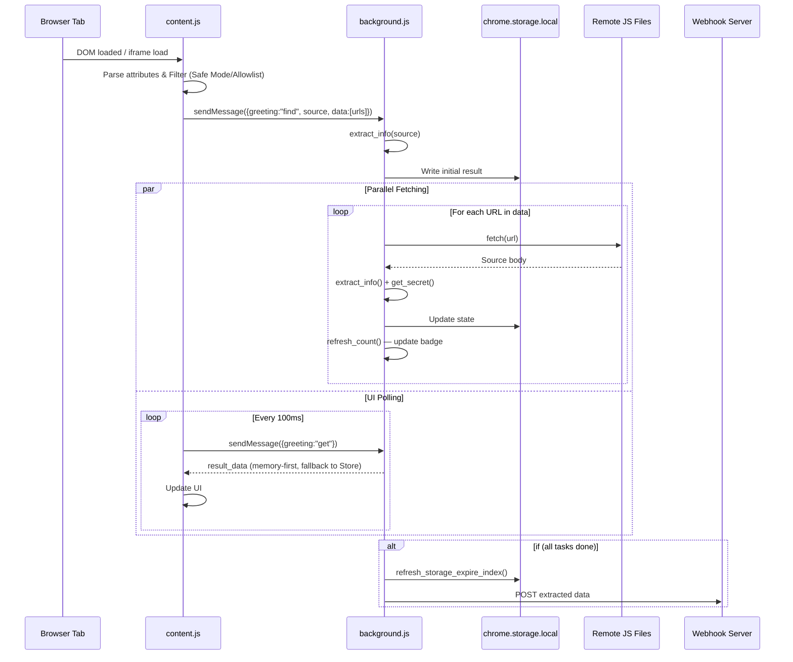

<p align="center">
  
</p>

<h1 align="center">ReconLens</h1>

<p align="center">
  <strong>Passive Reconnaissance Lens for the Modern Web</strong><br>
  A browser extension that silently extracts endpoints, secrets, and intelligence from web pages you visit.
</p>

<p align="center">
  <a href="#-features">Features</a> •
  <a href="#-installation">Installation</a> •
  <a href="#-how-it-works">How It Works</a> •
  <a href="#-configuration">Configuration</a> •
  <a href="#-detection-categories">Detection Categories</a> •
  <a href="#-webhook-integration">Webhook</a> •
  <a href="#-localization">Localization</a> •
  <a href="#-license">License</a>
</p>

---

## 🔍 What is ReconLens?

**ReconLens** is a passive information extraction tool built as a Manifest V3 browser extension. As you browse, it automatically analyzes the page source, inline scripts, and referenced JavaScript files to extract valuable reconnaissance data — all without sending any additional probing requests beyond what the page already loads.

Originally developed under the name *FindSomething* by [residuallaugh](https://github.com/momosecurity/FindSomething), ReconLens is a fork focused on modernization and expanded capabilities.

## ✨ Features

- **🚀 Performance-First Extraction:** High-speed regex matching optimized for modern web applications.
- **🧠 Deep Normalization Engine:** Automatically cleans and deduplicates harvested data. No more redundant protocols (`http/s`), trailing slashes, or duplicate domains.
- **🤖 AI-Ready Export:** Specialized "Copy for AI" engine that formats results into **Markdown**, **JSON**, **XML**, **HTML**, or **Plain Text**. Now includes **Target URL** and **Scan Timestamps** in every report header.
- **🔗 Interactive Dashboard:** Every extracted string is a clickable link. Includes per-item **Action Icons** (Copy + Lookups) for rapid data collection.
- **⚡ Quick Lookups:** Built-in SVG shortcuts for IP and Domain intelligence:
  - **Shodan & VirusTotal** for IP addresses.
  - **SecurityTrails & VirusTotal** for domains.
- **🎯 Smart URL Resolution:** Intelligent logic that distinguishes between domains (`google.com`) and relative paths (`/api/v1`), ensuring you always resolve to the correct target.
- **🌍 Internationalization (i18n):** Full support for English, Turkish, Chinese, and Arabic with **Instant Dynamic Switching** (no reload required).
- **🧠 Sticky UI State:** Automatically remembers and restores your last active category/tab across reloads or sessions.
- **🎨 Custom Cyber Aesthetic:** A professional, high-contrast UI with a signature purple/magenta color palette (`#c407ff`). Includes a centralized application layout for both popup and full-tab views.
- **🔧 Granular Configuration:** Enable/disable specific detection categories, customize allowed domains, and toggle badge notifications.
- **🛡️ Master Switch (Active Scan):** Complete control over the extraction engine. Toggle scanning on/off globally with a single click — icon badge shows "OFF" when inactive.
- **⚡ Webhook Integration & Testing:** Send your findings to a remote server for centralized reconnaissance. Includes a **Test Connection** feature to verify your endpoint instantly.
- **🔎 Neon-Powered Search:** Lightning-fast filtering across all results with professional **Neon Purple Highlighting** for matched terms.
- **🛡️ Privacy Focused:** All analysis happens locally in your browser. No data leaves your machine unless you explicitly configure a webhook.

> **Use Case:** Bug bounty hunters, penetration testers, and security researchers who want to passively collect endpoints, API keys, tokens, and sensitive data leaks while doing normal web browsing.
 
---
 
## 💡 Motivation
 
> *"The essence of penetration testing is information gathering. The detail and quality of the information collected directly correlates with the ability to discover vulnerabilities. The quantity and quality of information determines the size of the attack surface."* — **Momo Security**
 
Modern web applications are increasingly complex, often exposing sensitive internal logic, endpoints, and secrets through client-side JavaScript. Manually auditing these files is tedious, and standalone reconnaissance scripts are frequently bypassed during active engagement. ReconLens provides a seamless, automated, and passive way to capture this intelligence in real-time as you browse.

---

## ✨ Features

| Feature | Description |
|---|---|
| 🎯 **13 Detection Categories** | IP, Domain, URL, Path, JWT, Secrets, Emails, and more |
| 🔒 **700+ Secret Patterns** | Nuclei-powered regex engine for API keys, tokens, and credentials |
| 🛡️ **Safe Mode** | Only fetches `.js` files by default — no unexpected requests |
| 🌐 **Global Floating Window** | Embeds results directly into every page you visit |
| 📡 **Webhook Callbacks** | Forward extracted data to your own server in real-time |
| ⏱️ **Auto Timeout** | Terminate slow background fetches after 2 seconds |
| 📋 **One-Click Copy** | Copy any category or construct full URLs from relative paths |
| 🔢 **Badge Counter** | Extension icon shows the number of findings at a glance |
| 🗑️ **Auto Expiration** | Cached data expires after 7 days of inactivity |
| 🌍 **Multi-Language** | EN, TR, ZH, AR supported with **Instant Dynamic Switching** |
| 🧠 **Sticky Tabs** | Remembers your last viewed category across reloads |
| 🌗 **Dark Mode** | Native support for Light, Dark, and System (Auto) themes |
| 🦊 **Cross-Browser** | Native support for both **Chrome** and **Firefox** (MV3) |

---

## 📦 Installation

### Chrome / Edge / Brave (Chromium-based)

1. Download or clone this repository:
   ```bash
   git clone https://github.com/fr0stb1rd/ReconLens.git
   ```
2. Open your browser and navigate to `chrome://extensions/`
3. Enable **Developer mode** (toggle in the top right)
4. Click **Load unpacked** and select the cloned directory
5. Pin the ReconLens icon in your toolbar for quick access

### Firefox

1. Download or clone this repository.
2. Navigate to `about:debugging#/runtime/this-firefox`
3. Click **Load Temporary Add-on** and select the `manifest.json` file from the project directory.
4. (ReconLens is fully compatible with Firefox MV3 out of the box)

---

## ⚙️ How It Works

ReconLens operates through a sophisticated asynchronous pipeline:



### Execution Pipeline Details

### 1. Content Script — Collection (`content.js`)
- Extracts the full `outerHTML` of the current page (including iframes)
- Parses all `src` and `href` attributes to build a target list
- In **Safe Mode** (default), only JavaScript file URLs are collected
- Respects the **Domain Allowlist** — skips allowlisted domains entirely
- Sends the page source and target list to the background service worker

### 2. Background Service Worker — Analysis (`background.js`)
- Receives page data and fetches each target URL in the background
- Runs **regex-based extraction** across all fetched content:
  - Standard patterns for IPs, domains, URLs, paths, emails, phone numbers, ID cards, JWTs, and crypto algorithms
  - **700+ Nuclei-derived secret patterns** for API keys (AWS, GCP, GitHub, GitLab, Slack, DingTalk, Feishu, WeChat, etc.), Bearer/Basic tokens, private keys, passwords, and webhook URLs
- Deduplicates results, separates static assets, and tracks data provenance (source URL for each finding)
- Persists results to `chrome.storage.local` with automatic 7-day expiration
- Triggers **Webhook callbacks** upon completion if configured

### 3. Popup / Floating Window — Presentation
- **Popup** (`popup.html`): Card-based sidebar UI with category navigation, copy buttons, and real-time progress tracking
- **Floating Window** (`content.js`): Draggable overlay embedded into every page when enabled — shows results without opening the popup

---

## 🎯 Detection Categories

| Category | Examples |
|---|---|
| **IP** | `192.168.1.1`, `//10.0.0.1` |
| **IP & Port** | `192.168.1.1:8080` |
| **Domain** | `api.example.com`, `internal.corp.net` |
| **Path** | `/api/v1/users`, `./config/settings` |
| **Incomplete Path** | `admin/dashboard`, `static/js/app` |
| **URL** | `https://api.example.com/v2/users?id=1` |
| **Static Resources** | `.js`, `.css`, `.jpg`, `.png`, `.svg`, `.ico` files |
| **ID Card** | Chinese national ID numbers (15/18 digit) |
| **Mobile** | Chinese mobile phone numbers |
| **Email** | `admin@example.com` |
| **JWT** | `eyJhbGciOiJIUzI1NiIs...` |
| **Algorithm** | `CryptoJS.AES`, `btoa()`, `RSA`, `md5()`, `sha256()` |
| **Sensitive Info** | API keys, tokens, passwords, private keys, webhook URLs |

---

## 🛠️ Configuration

Access the settings page via the **Settings** tab in the popup.

### General Settings

| Setting | Default | Description |
|---|---|---|
| **Clear Cache** | — | Immediately purge all stored extraction data |
| **Global Floating Window** | Off | Embed a draggable results panel into every page |
| **Auto Timeout** | Off | Abort background fetches after 2 seconds |
| **Safe Mode** | **On** | Only fetch JavaScript resources (recommended) |
| **Language Selection** | Auto | Manually select UI language (EN, TR, ZH, AR) |
| **Theme** | Auto | Toggle between Light, Dark, or System Default |

> ⚠️ **Warning:** Disabling Safe Mode will cause ReconLens to fetch **all** `src` and `href` URLs, including images, CSS, and API endpoints. This may trigger unintended requests or navigate away from the current page.

### Domain Allowlist

Domains matching entries in the allowlist will be **completely skipped** — no extraction will occur.

- Enter the **suffix** of each domain, one per line
- Default: `.google.com`, `.amazon.com`, `portswigger.net`

---

## 📡 Webhook Integration

Forward extracted data to your own server or SIEM for automated processing.

| Field | Description |
|---|---|
| **Callback URL** | The endpoint to receive data |
| **Method** | `GET` or `POST` (POST recommended due to GET length limits) |
| **Parameters** | Optional parameter name for the request body |
| **Custom Headers** | JSON object for authentication headers |
| **Connection Test** | Dedicated button to verify your endpoint settings instantly |

### Payload Format

- **With parameter name:** `paramName={"ip":["1.2.3.4"],"domain":["api.example.com"],...}`
- **Without parameter name:** Raw JSON body with full extraction results

The payload includes: configuration, progress status, all extracted data by category, and source URL provenance.

> 💡 **Tip:** Some pages produce very large payloads. Ensure your webhook endpoint can handle large request bodies.

---

## 🌍 Localization

ReconLens supports four languages out of the box:

| Language | Locale Code |
|---|---|
| 🇬🇧 English | `en` (default) |
| 🇹🇷 Turkish | `tr` |
| 🇨🇳 Chinese (Simplified) | `zh_CN` |
| 🇸🇦 Arabic | `ar` |

The language is automatically selected based on your browser's locale settings, but can be **manually overridden** in the Settings page.

---

## 📁 Project Structure

```
ReconLens/
├── manifest.json          # Extension manifest (MV3 - Cross-browser)
├── polyfill.js            # i18n bridge & manual localization engine
├── background.js          # Service worker — data extraction & regex engine
├── content.js             # Content script — page analysis & floating panel
├── popup.html             # Main UI (SPA) - Includes Settings & About
├── popup.js               # Logic for results, settings, and navigation
├── _locales/              # Multi-language support (EN, TR, ZH, AR)
├── icons/                 # Extension brand assets
├── README.md              # Project documentation
├── org/                   # Original FindSomething project files
└── LICENSE                # GPL-3.0
```

---

## 🤝 Contributing

Contributions are welcome! Whether it's new regex patterns, additional language support, UI improvements, or bug fixes — feel free to open an issue or submit a pull request.

---

## 📄 License

This project is licensed under the **GNU General Public License v3.0** — see the [LICENSE](LICENSE) file for details.

---

## 🙏 Credits

- Original project FindSomething by [residuallaugh](https://github.com/momosecurity/FindSomething) - [Blog](https://security.immomo.com/blog/145)
- Secret detection patterns derived from the [Nuclei](https://github.com/projectdiscovery/nuclei) project by ProjectDiscovery
- UI contributions by [M1r0ku](https://github.com/M1r0ku/FindSomething)
- Additional contributions by [osxtest](https://github.com/osxtest)
- ReconLens Modernization by [fr0stb1rd](https://github.com/fr0stb1rd)

---

<p align="center">
  A <b><a href="https://sekademi.github.io/">Sekademi Cybersecurity</a></b> Product
</p>
